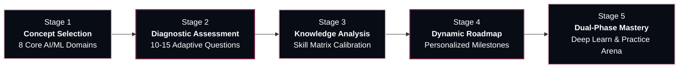
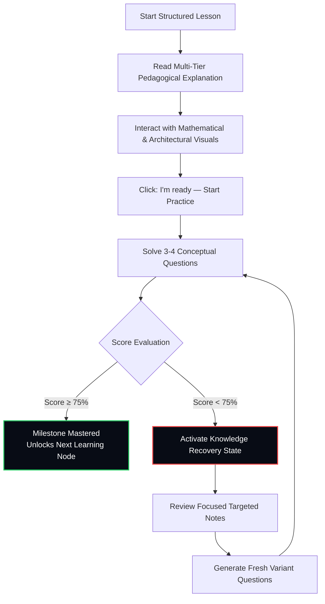

<div align="center">

# LOGIQ 🧠
### Next-Generation Personalized AI & Machine Learning Cognitive Tutor

[](https://opensource.org/licenses/MIT)
[](https://react.dev/)
[](https://www.typescriptlang.org/)
[](https://tailwindcss.com/)
[](https://vitejs.dev/)
[](https://ai.google.dev/)
[](CONTRIBUTING.md)
[](PRIVACY.md)

<p align="center">
  <strong>An intelligent, student-centered learning platform built to master Artificial Intelligence and Machine Learning from first mathematical principles to production deployment.</strong>
</p>

<p align="center">
  <a href="#-executive-summary">Executive Summary</a> •
  <a href="#-system-architecture">Architecture</a> •
  <a href="#-pedagogical-framework">Pedagogy</a> •
  <a href="#-key-features">Key Features</a> •
  <a href="#-dynamic-visualizations">Visual Engine</a> •
  <a href="#-supported-tracks">Curriculum</a> •
  <a href="#-project-structure">Structure</a> •
  <a href="#-getting-started">Getting Started</a> •
  <a href="#-configuration">Configuration</a> •
  <a href="#-license">License</a>
</p>

---

</div>

## 📌 Executive Summary

Modern AI education suffers from three fundamental bottlenecks:
1. **Passive Tutorial Hell**: Students watch video playlists or read static documentation without active mental model verification or immediate mathematical feedback.
2. **Rigid, Monolithic Curricula**: One-size-fits-all roadmaps force students through concepts they already know or skip foundational prerequisites required for advanced architectures.
3. **Superficial Gamification**: Vanity streaks and fabricated progress statistics mask critical conceptual gaps, causing students to fail when implementing real-world systems.

**LOGIQ** solves this paradigm through a **closed-loop cognitive tutoring architecture**. It pairs adaptive diagnostic knowledge evaluations with multi-tiered pedagogical explanations (intuition $\to$ formal theory $\to$ mathematics $\to$ dynamic visual geometry $\to$ concrete calculations $\to$ production trade-offs), backed by an adaptive practice arena featuring real-time distractor analysis and non-punitive recovery loops.

---

## 🏛️ System Architecture

LOGIQ is built on a high-throughput, client-side reactive architecture using **React 19**, **TypeScript**, and **Tailwind CSS v4**, operating seamlessly either connected to **Google Gemini API** or via an offline deterministic educational synthesis engine.

```mermaid
graph TD
    subgraph Presentation_Layer [Presentation & Viewport Layer (100% Desktop Viewport)]
        A1[Fixed Glass Sidebar]
        A2[Dynamic Atmospheric Shell]
        A3[Adaptive Header & Route Engine]
        A4[Interactive Canvas & SVG Visualizers]
    end

    subgraph State_Engine [Core Reactive State Management]
        B1[AppContext Container]
        B2[Local Persistence Sync]
        B3[Zero-Telemetry Security Guard]
    end

    subgraph Pedagogical_Pipelines [Pedagogical Intelligence Pipeline]
        C1[Adaptive Diagnostic Engine<br/>10-15 Variable Questions]
        C2[Knowledge Graph Analyzer<br/>Gap & Proficiency Calibration]
        C3[Personalized Roadmap Synthesizer<br/>Milestone Dependency Ordering]
        C4[Multi-Tier Lesson Engine<br/>Intuition to Production]
        C5[Practice Arena & Distractor Evaluator]
        C6[Non-Punitive Recovery Loop<br/>Score &lt; 75%]
    end

    subgraph Intelligence_Layer [Dual-Engine Intelligence Layer]
        D1[Google Gemini 2.5 Flash API<br/>Structured JSON Schema]
        D2[Offline Pedagogical Synthesis Engine<br/>Deterministic Fallback]
    end

    Presentation_Layer --> State_Engine
    State_Engine --> Pedagogical_Pipelines
    Pedagogical_Pipelines --> Intelligence_Layer
    Intelligence_Layer --> Pedagogical_Pipelines
    Pedagogical_Pipelines --> Presentation_Layer
```

---

## 🔄 5-Stage Adaptive Pedagogical Journey

Every student in LOGIQ begins from a clean, genuine first-user state without fake progress metrics or vanity streaks. The educational progression flows through five continuous stages:



### The Closed-Loop Practice & Remediation Flow



---

## ✨ Key Features

### 1. Adaptive Diagnostic Assessment Engine
* **Dynamic Breadth Sizing**: Rather than presenting a rigid number of questions, LOGIQ calibrates test length between **10 and 15 questions** based on topic breadth, depth, and prerequisite complexity.
* **Granular Knowledge Mapping**: Evaluates foundational, intermediate, and advanced competencies across selected topics.
* **Calibrated Baseline Proficiency**: Identifies validated proficiencies, isolated concept gaps, and optimal learning velocity without fabricating beginner progress.

### 2. Multi-Layer Pedagogical Explanation Framework
Every lesson is generated and formatted according to a **6-layer cognitive decomposition**:
1. **Intuitive Hook ("Why It Exists")**: Establishes teleology and historical context before formal terminology is introduced.
2. **Core Mechanical Concepts & Vocabulary**: Demystifies technical jargon through memorable, physical analogies.
3. **Rigorous Mathematical Formulation**: LaTeX-style equation cards breaking down parameters, dimensions, and operations:
   $$\sigma(z) = \frac{1}{1 + e^{-z}}, \quad \text{where } z = \mathbf{w}^T \mathbf{x} + b$$
4. **Dynamic Programmatic Visualizations**: Live interactive graphs, algorithm flowcharts, and neural architectures.
5. **Concrete Numerical Walkthrough**: Step-by-step calculations with sample numerical vectors.
6. **Real-World Applied Engineering & Trade-offs**: Industry deployment considerations, computational costs, and failure modes.

### 3. Dynamic Programmatic Visualizations
* **Interactive Sigmoid S-Curve**: Includes a live interactive slider ($z \in [-6, 6]$) computing $\sigma(z)$ with real-time coordinate tracking and asymptotic limits ($z \to \infty \implies 1$, $z \to -\infty \implies 0$).
* **Computational Flowcharts**: Step-by-step visual pipelines illustrating backpropagation, gradient descent, transformer self-attention, and training loops.
* **Neural Architecture Diagrams**: Layer-by-layer topologies detailing tensor shapes, receptive fields, and activation dynamics.
* **Comparative Trade-off Matrices**: Glass comparison tables contrasting loss functions (e.g., MSE vs. Cross-Entropy) and optimization algorithms (e.g., SGD vs. AdamW).

### 4. Practice Arena & Cognitive Remediation
* **Targeted Conceptual Questions**: Context-aware multiple-choice assessments evaluating reasoning rather than syntax recall.
* **Distractor Breakdown**: Instant feedback explaining not only why the correct answer is valid, but precisely why alternative options fail.
* **Remedial Recovery Engine**: When a student scores below 75%, LOGIQ triggers a targeted refresher with custom review notes and generates a brand-new set of question variants.

### 5. Dual-Mode Intelligence Layer
* **Google Gemini API Integration**: Native support for `gemini-2.5-flash`, `gemini-1.5-pro`, and customized endpoints using structured JSON schemas.
* **In-App Engine Switcher**: Configure keys and models on the fly through the dedicated UI settings modal or standard environment variables.
* **Offline Educational Synthesis**: Zero-downtime offline fallback guarantees 100% platform uptime even without API keys or active internet connections.

### 6. Industrial Visual System & Desktop Layout
* **100% Desktop Viewport Utilization**: Seamless full-screen layout free of artificial width clamps or dead gutters.
* **Atmospheric Technology Foundation**: Layered Midnight Blue (`#080C15`) with deep indigo/plum ambient radial gradients, subtle coordinate grids, circuit conduits, and restrained Blush Pink (`#F5CAD6`) highlights.
* **Tri-Font Typographic Hierarchy**:
  * **Termina Heavy**: High-impact brand headers, major page titles, and numerical milestones.
  * **Instrument Serif**: Editorial reflections, pedagogical quotes, and historical context.
  * **Inter**: High-legibility technical prose, mathematics, code snippets, and UI controls.

---

## 🎯 Supported Learning Tracks

LOGIQ covers eight foundational and modern AI/ML tracks, each equipped with dedicated curricula, diagnostic banks, and practice modules:

| Track | Primary Focus | Key Milestones & Topics Covered |
| :--- | :--- | :--- |
| **Machine Learning** | Classical ML & Statistical Learning | Supervised Learning, Cost Functions, Logistic Regression, Decision Trees, Ensembles (Random Forest, XGBoost) |
| **Deep Learning** | Neural Networks & Representations | Perceptrons, MLP, Backpropagation, Activation Functions, CNNs, Transformers, Optimization |
| **Computer Vision** | Spatial Intelligence & Perception | Image Convolutions, Feature Maps, Object Detection (YOLO), Segmentation, ViTs |
| **Natural Language Processing** | Linguistic Modeling & Semantics | Tokenization, Word Embeddings, Seq2Seq, Attention Mechanisms, BERT, Pre-training |
| **Generative AI & LLMs** | Autoregressive & Generative Models | Transformer Architecture, KV-Cache, RLHF, DPO, Temperature/Top-P Sampling, Prompt Engineering |
| **Agentic AI** | Autonomous Cognitive Architectures | ReAct Framework, Function Calling, Planning & Reflection, Memory Systems, Multi-Agent Swarms |
| **Reinforcement Learning** | Decision Theory & Policy Learning | Markov Decision Processes, Bellman Equations, Q-Learning, Policy Gradients (PPO), Reward Shaping |
| **ML Mathematics** | Foundational Analytical Tools | Linear Algebra (Eigenvalues, SVD), Multivariable Calculus (Jacobians, Hessians), Probability & Bayes |

---

## 📂 Project Structure

```text
logicQ/
├── public/                      # Static assets & web manifests
├── src/
│   ├── assets/                  # Hero illustrations, vector badges, logos
│   ├── components/
│   │   ├── common/              # Shared high-impact UI primitives
│   │   │   ├── BackgroundAtmosphere.tsx  # Multi-layered ambient background & grid engine
│   │   │   ├── LessonVisualRenderer.tsx  # Dynamic Sigmoid, Flowcharts, Diagrams, Tables
│   │   │   └── Logo.tsx                  # Branded LOGIQ SVG wordmark
│   │   ├── layout/              # Full-viewport layout scaffolding
│   │   │   ├── Header.tsx                # Context-aware global navigation bar & progress stats
│   │   │   ├── MobileNav.tsx             # Responsive mobile navigation drawer
│   │   │   └── Sidebar.tsx               # Fixed full-height glass sidebar navigation
│   │   └── pages/               # Primary platform views
│   │       ├── DashboardPage.tsx         # Active curriculum overview, metrics & learning hub
│   │       ├── HistoryPage.tsx           # Chronological timeline of completed exercises & assessments
│   │       ├── LearnPage.tsx             # 6-tier professor-grade structured lesson view
│   │       ├── MyPathPage.tsx            # Interactive curriculum roadmap & milestone progress
│   │       ├── PracticePage.tsx          # Adaptive practice arena with remediation loops
│   │       ├── ProfilePage.tsx           # User settings, diagnostic proficiencies & badges
│   │       ├── ProgressPage.tsx          # Skill matrix radar & knowledge retention statistics
│   │       ├── SettingsPage.tsx          # LLM engine configuration & API key management
│   │       ├── WelcomeReturn.tsx         # Quick-resume screen for returning learners
│   │       └── OnboardingFlow/           # 5-stage adaptive diagnostic & onboarding pipeline
│   │           ├── ChooseConcepts.tsx        # Track selection interface (8 AI/ML domains)
│   │           ├── DiagnosticAssessment.tsx  # Adaptive 10-15 question diagnostic quiz
│   │           ├── KnowledgeAnalysis.tsx     # Granular gap & strength analysis visualization
│   │           ├── LearningInterests.tsx     # Goal specification & pacing calibration
│   │           ├── PathCreation.tsx          # Dynamic roadmap synthesis animation
│   │           └── WelcomeNew.tsx            # Initial landing page & platform briefing
│   ├── context/
│   │   └── AppContext.tsx       # Core state management, user profile, diagnostic & progress store
│   ├── data/
│   │   ├── aimlConcepts.ts      # Comprehensive track definitions, topics & diagnostic item pools
│   │   └── lessonsData.ts       # Structured base curricula & lesson metadata
│   ├── services/
│   │   └── llmService.ts        # Dual-mode engine (Google Gemini API + Offline Synthesis)
│   ├── types/
│   │   └── index.ts             # Strict TypeScript interfaces & data contracts
│   ├── App.tsx                  # Top-level viewport shell & page route coordinator
│   ├── index.css                # Tailwind CSS v4 directives, custom font rules & animations
│   ├── main.tsx                 # React 19 application root entry point
│   └── vite-env.d.ts            # Vite client environment type declarations
├── .env.example                 # Environment configuration template
├── .gitignore                   # Git exclusion rules
├── index.html                   # HTML5 document entry & font imports
├── package.json                 # Project dependencies & scripts
├── tsconfig.json                # TypeScript compiler configuration
└── vite.config.ts               # Vite build pipeline & Tailwind v4 plugin setup
```

---

## 🚀 Getting Started

### Prerequisites

* **Node.js**: `v18.0.0` or higher (LTS recommended)
* **Package Manager**: `npm` (bundled with Node), `yarn`, or `pnpm`

### Installation & Quick Start

1. **Clone the repository**:
   ```bash
   git clone https://github.com/Kajalsiwach/-LogicQ-Personalised-AI-Tutor-for-Learning-AI.git
   cd -LogicQ-Personalised-AI-Tutor-for-Learning-AI
   ```

2. **Install project dependencies**:
   ```bash
   npm install
   ```

3. **Configure Environment Variables** *(Optional)*:
   ```bash
   cp .env.example .env
   ```
   Open `.env` and provide your Google Gemini API key:
   ```env
   VITE_GEMINI_API_KEY=your_gemini_api_key_here
   VITE_LLM_MODEL=gemini-2.5-flash
   ```
   > 💡 **Note**: You do not strictly need an API key to run or test LOGIQ. If no key is provided, LOGIQ automatically leverages its built-in **Offline Educational Synthesis Engine** to generate complete, structured lessons. You can also configure your API key anytime in the app via **Settings**.

4. **Launch the development server**:
   ```bash
   npm run dev
   ```
   Navigate to `http://localhost:5173` in your browser.

5. **Build for production**:
   ```bash
   npm run build
   npm run preview
   ```

---

## ⚙️ Configuration

LOGIQ allows flexible engine configuration either through environment variables or at runtime using the in-app **Settings** modal:

| Variable | Type | Default | Description |
| :--- | :--- | :--- | :--- |
| `VITE_GEMINI_API_KEY` | `string` | `""` | Google AI Studio Gemini API Key. |
| `VITE_LLM_PROVIDER` | `'gemini' \| 'custom'` | `'gemini'` | LLM API provider protocol. |
| `VITE_LLM_MODEL` | `string` | `'gemini-2.5-flash'` | Model identifier (e.g. `gemini-2.5-flash`, `gemini-1.5-pro`). |
| `VITE_LLM_ENDPOINT` | `string` | *Optional* | Custom reverse proxy or gateway endpoint URL. |

---

## 🧰 Tech Stack Matrix

| Category | Technology | Version | Purpose |
| :--- | :--- | :--- | :--- |
| **Core Framework** | [React](https://react.dev/) | `19.3.0` | Concurrent UI component architecture |
| **Language** | [TypeScript](https://www.typescriptlang.org/) | `6.0.2` | Static type safety across state and API contracts |
| **Build Tool** | [Vite](https://vitejs.dev/) | `8.3.0` | Lightning-fast HMR and optimized asset bundling |
| **Styling** | [Tailwind CSS](https://tailwindcss.com/) | `4.3.3` | Next-generation utility-first styling engine |
| **Iconography** | [Lucide React](https://lucide.dev/) | `1.49.0` | Crisp, scalable geometric vector icons |
| **Visual Effects** | [Canvas Confetti](https://www.npmjs.com/package/canvas-confetti) | `1.9.4` | Milestone celebration particles |
| **AI Integration** | [Google Gemini](https://ai.google.dev/) | `v1beta / REST` | High-fidelity dynamic lesson synthesis |
| **State & Storage** | React Context + Web Storage | *Native* | Zero-overhead, zero-telemetry local state caching |

---

## 🛡️ Security, Privacy & Zero-Telemetry Commitment

* **100% Client-Side Processing**: All student assessment logs, mastery matrices, and roadmaps are stored directly in your browser's `localStorage`.
* **Zero User Tracking**: No third-party behavioral analytics, fingerprinting, or tracking scripts are embedded in LOGIQ.
* **Secure Key Management**: When you input a Gemini API key in the in-app settings, it is saved exclusively on your local client and communicated directly to the official Google Gemini API endpoint over TLS.

---

## 🤝 Contributing

Contributions to LOGIQ are welcomed! Whether you want to add new curriculum topics, design interactive mathematical visualizers, or refine pedagogical prompts, please follow these steps:

1. **Fork the Repository** on GitHub.
2. **Create a Feature Branch**:
   ```bash
   git checkout -b feature/interactive-attention-heatmap
   ```
3. **Commit Your Changes** using [Conventional Commits](https://www.conventionalcommits.org/):
   ```bash
   git commit -m "feat(visuals): add interactive multi-head attention visualizer"
   ```
4. **Push to Your Branch**:
   ```bash
   git push origin feature/interactive-attention-heatmap
   ```
5. **Open a Pull Request** describing your motivation, methodology, and verification steps.

---

## 📜 License

This project is licensed under the **MIT License**. See the [LICENSE](LICENSE) file for complete details.

---

<div align="center">
  <sub>Engineered with precision for students, researchers, and engineers mastering artificial intelligence.</sub>
</div>
